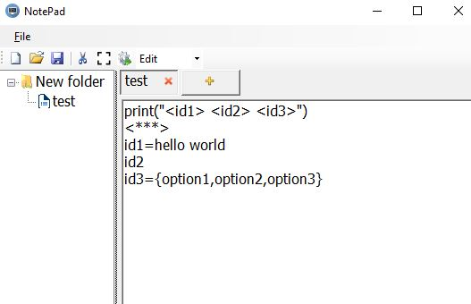
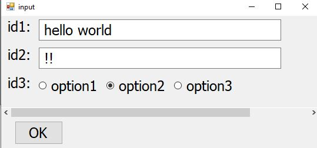
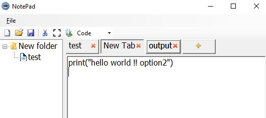
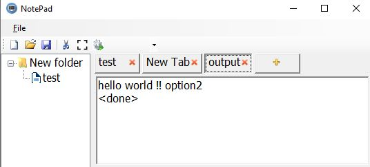

# what does this app used for?
the main purpose of this app is to generate codes.

# how do we use it?
1- drag and drop a Folder in the left side of the spliter

2- create a file and call it test

3- write this text in test file
print("<id1> <id2> <id3>")
<***>
id1=hello world
id2
id3={option1,option2,option3}

4- create new tap

5- change the option from Edit to Code

6- press at test file 

7- press F5 to run python code if you have installed it

